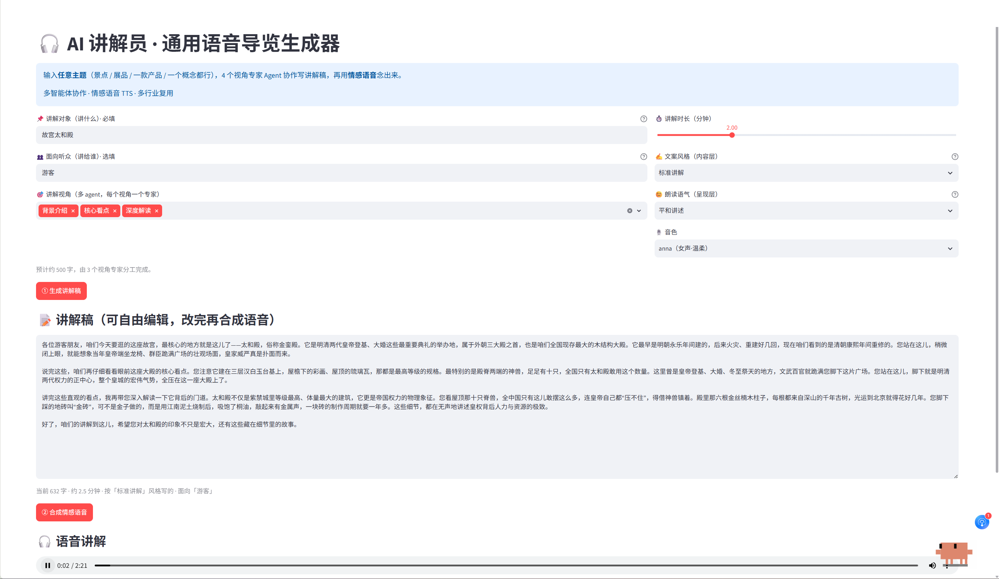

# 🎧 AI 讲解员 · 通用语音导览生成器

输入**任意主题**，多个 AI Agent 分工协作写出讲解稿，再用**情感语音**念出来。

景点、展品、一款产品、一个抽象概念都能讲——不绑定行业。

---

## 界面预览



> 以「故宫太和殿」为例：面向游客、标准讲解风格，3 个视角专家 Agent 协作产出 632 字讲解稿，
> 人工确认后合成 2 分 21 秒情感语音。稿子在页面上可直接编辑，改完再合成。

---

## 它解决什么问题

做语音导览 / 讲解内容，传统方式是「人写稿 → 人配音」，成本高、改一版重录一次。
用单个大模型一把梭生成，又容易写得平、缺层次。

这个工具把它拆成**多视角协作 + 人工确认 + 情感合成**三段：

```
主题/听众/风格
      ↓
┌─────────────────────────────┐
│  4 个视角专家 Agent（并行）    │   背景介绍 / 核心看点 / 深度解读 / 实用延伸
└─────────────────────────────┘
      ↓
   总控 Agent  ——  加开场、过渡、收尾，串成一篇连贯口语稿
      ↓
   ✍️ 人工编辑确认（可自由修改）
      ↓
   🔊 CosyVoice 情感语音合成
```

## 核心设计决策

| 决策 | 为什么 |
|---|---|
| **拆成多个视角 Agent，而不是一个大 prompt** | 职责分离，每段可独立评估质量；单 prompt 写长稿容易各部分同质化 |
| **内容层与呈现层解耦**（文案风格 / 朗读语气分开选） | 真实场景常需「文案严谨但念得亲切」（如博物馆导览）。绑死就没法调；且只改语气时不必重写稿子 |
| **三个正交输入变量**（讲什么 / 讲给谁 / 怎么讲） | 同一对象讲给小学生和讲给专家，深度完全不同。听众是内容生成的关键变量，不能混在主题里 |
| **人在回路：稿子必须人工确认后才合成语音** | ① AI 写的东西人得能改；② TTS 按字符计费、比文本贵，不该为未确认的稿子付费 |
| **时长→字数分配改用代码计算** | 原项目用 GPT-4o 做这步。这是确定性计算，不该占一次模型调用——更快、更省、结果稳定 |
| **不接联网搜索** | 讲解稿依赖的是通识而非实时数据，省一次工具调用的成本与延时 |

## 技术栈

- **多 Agent 编排**：OpenAI Agents SDK
- **模型**：DeepSeek（`deepseek-chat`，OpenAI 兼容接口）
- **语音合成**：硅基流动 CosyVoice2（支持自然语言指令控制情感语气）
- **界面**：Streamlit

## 快速开始

```bash
python -m venv venv
venv\Scripts\pip install -r requirements.txt      # Windows
# source venv/bin/activate && pip install -r requirements.txt   # macOS/Linux

streamlit run ai_voice_guide.py
```

在页面左侧填入两个 API Key（均不会写入代码或磁盘）：

| Key | 用途 | 获取 |
|---|---|---|
| DeepSeek | 多 Agent 写稿 | [platform.deepseek.com](https://platform.deepseek.com) |
| 硅基流动 | CosyVoice2 情感语音合成 | [siliconflow.cn](https://siliconflow.cn) |

## 使用

1. 填写**讲解对象**（必填）和**面向听众**（选填，影响用词深浅）
2. 选讲解视角、时长、**文案风格**、**朗读语气**、音色
3. 点「① 生成讲解稿」→ 在文本框里自由编辑
4. 点「② 合成情感语音」→ 试听 / 下载

> 换个朗读语气再点一次 ②，可以对比同一段稿子的不同情绪表现，无需重新生成稿子。

## 项目结构

```
agent.py             # 4 个视角专家 + 1 个总控 Agent 的定义与 prompt
manager.py           # 编排：字数分配 → 并行调用视角专家 → 总控组装
ai_voice_guide.py    # Streamlit 界面 + CosyVoice 情感语音合成
```

## 项目背景与改造说明

本项目以 [awesome-llm-apps](https://github.com/Shubhamsaboo/awesome-llm-apps)（Apache-2.0）中的
`ai_audio_tour_agent` 为起点重构。原项目是面向英文旅游场景、依赖 OpenAI 全家桶的 demo；
下表列出本项目重新设计的部分：

| 维度 | 原项目 | 本项目 |
|---|---|---|
| 适用场景 | 旅游导览四维度（历史/建筑/文化/美食） | 通用讲解四视角，任意行业主题可用 |
| 技术栈 | GPT-4o + gpt-4o-mini-tts + 联网搜索 | DeepSeek + CosyVoice2（国内可直接使用） |
| 时长分配 | 由 GPT-4o 规划 | 改为代码计算，省一次模型调用且结果稳定 |
| 人工介入 | 生成后直接合成语音 | 增加人工编辑确认环节，确认后才合成（控成本、可润色） |
| 风格控制 | 单一语气参数 | 内容层（文案风格）与呈现层（朗读语气）解耦 |
| 输入变量 | 主题 + 兴趣 | 主题 / 听众 / 风格 三个正交变量 |
| 界面语言 | 英文 | 全中文 |
